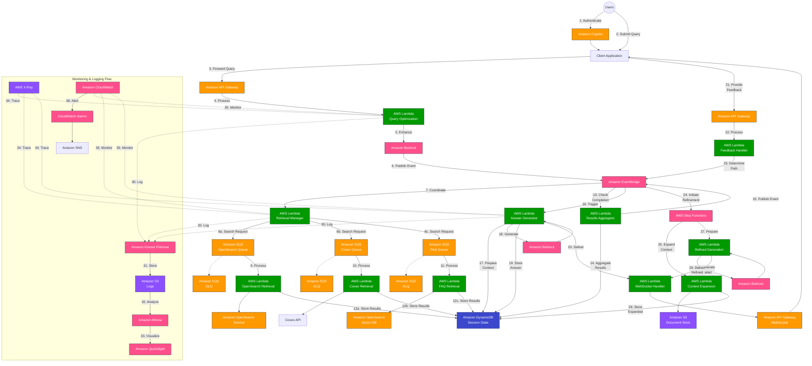

# AWS Architecture Knowledge Search

```mermaid
flowchart TB
    %% User and Authentication Layer
    Users((Users)) --> |"1. Authenticate"| Cognito[Amazon Cognito]
    Users --> |"2. Submit Query"| ClientApp[Client Application]
    Cognito --> ClientApp
    ClientApp --> |"3. Forward Query"| APIGW[Amazon API Gateway]
    
    %% Query Processing Path
    APIGW --> |"4. Process"| QueryLambda[AWS Lambda\nQuery Optimization]
    QueryLambda --> |"5. Enhance"| Bedrock1[Amazon Bedrock]
    Bedrock1 --> |"6. Publish Event"| MainEventBridge[Amazon EventBridge]
    
    %% Retrieval Orchestration
    MainEventBridge --> |"7. Coordinate"| RetrievalManager[AWS Lambda\nRetrieval Manager]
    
    %% Parallel Retrieval Paths
    RetrievalManager --> |"8a. Search Request"| OpenSearchQueue[Amazon SQS\nOpenSearch Queue]
    RetrievalManager --> |"8b. Search Request"| CoveoQueue[Amazon SQS\nCoveo Queue]
    RetrievalManager --> |"8c. Search Request"| FAQQueue[Amazon SQS\nFAQ Queue]
    
    %% Error Handling
    OpenSearchQueue -.-> OpenSearchDLQ[Amazon SQS\nDLQ]
    CoveoQueue -.-> CoveoDLQ[Amazon SQS\nDLQ]
    FAQQueue -.-> FAQDLQ[Amazon SQS\nDLQ]
    
    %% Retrieval Lambdas
    OpenSearchQueue --> |"9. Process"| OpenSearchLambda[AWS Lambda\nOpenSearch Retrieval]
    CoveoQueue --> |"10. Process"| CoveoLambda[AWS Lambda\nCoveo Retrieval]
    FAQQueue --> |"11. Process"| FAQLambda[AWS Lambda\nFAQ Retrieval]
    
    %% Knowledge Sources
    OpenSearchLambda --> OpenSearch[Amazon OpenSearch Service]
    CoveoLambda --> CoveoAPI[Coveo API]
    FAQLambda --> VectorDB[Amazon OpenSearch\nVector DB]
    
    %% Results Storage
    OpenSearchLambda --> |"12a. Store Results"| DynamoDB1[Amazon DynamoDB\nSession State]
    CoveoLambda --> |"12b. Store Results"| DynamoDB1
    FAQLambda --> |"12c. Store Results"| DynamoDB1
    
    %% Results Aggregation
    MainEventBridge --> |"13. Check\nCompletion"| AggregatorLambda[AWS Lambda\nResults Aggregator]
    AggregatorLambda --> |"14. Aggregate\nResults"| DynamoDB1
    AggregatorLambda --> |"15. Publish Event"| MainEventBridge
    
    %% Answer Generation
    MainEventBridge --> |"16. Trigger"| GeneratorLambda[AWS Lambda\nAnswer Generator]
    GeneratorLambda --> |"17. Prepare\nContext"| DynamoDB1
    GeneratorLambda --> |"18. Generate"| Bedrock2[Amazon Bedrock]
    Bedrock2 --> GeneratorLambda
    GeneratorLambda --> |"19. Store\nAnswer"| DynamoDB1
    
    %% Real-time Delivery
    GeneratorLambda --> |"20. Deliver"| WSHandler[AWS Lambda\nWebSocket Handler]
    WSHandler --> WSGateway[Amazon API Gateway\nWebSocket]
    WSGateway --> ClientApp
    
    %% Feedback Loop
    ClientApp --> |"21. Provide\nFeedback"| FeedbackAPI[Amazon API Gateway]
    FeedbackAPI --> |"22. Process"| FeedbackLambda[AWS Lambda\nFeedback Handler]
    FeedbackLambda --> |"23. Determine\nPath"| MainEventBridge
    
    %% Refinement Process
    MainEventBridge --> |"24. Initiate\nRefinement"| StepFunctions[AWS Step Functions]
    StepFunctions --> |"25. Expand\nContext"| ContextLambda[AWS Lambda\nContext Expansion]
    ContextLambda --> S3Docs[Amazon S3\nDocument Store]
    ContextLambda --> |"26. Store\nExpanded"| DynamoDB1
    StepFunctions --> |"27. Prepare"| RefinedGenLambda[AWS Lambda\nRefined Generation]
    RefinedGenLambda --> |"28. Generate\nDetailed"| Bedrock3[Amazon Bedrock]
    Bedrock3 --> RefinedGenLambda
    RefinedGenLambda --> |"29. Deliver\nRefined"| WSHandler
    
    %% Logging and Monitoring
    subgraph "Monitoring & Logging Flow"
        Firehose[Amazon Kinesis Firehose]
        S3Logs[Amazon S3\nLogs]
        Athena[Amazon Athena]
        QuickSight[Amazon QuickSight]
        XRay[AWS X-Ray]
        CloudWatch[Amazon CloudWatch]
        Alarms[CloudWatch Alarms]
        SNS[Amazon SNS]
        
        Firehose --> |"31. Store"| S3Logs
        S3Logs --> |"32. Analyze"| Athena
        Athena --> |"33. Visualize"| QuickSight
        CloudWatch --> |"36. Alert"| Alarms
        Alarms --> SNS
    end
    
    %% Logging Connections (simplified to reduce clutter)
    QueryLambda -.-> |"30. Log"| Firehose
    RetrievalManager -.-> |"30. Log"| Firehose
    GeneratorLambda -.-> |"30. Log"| Firehose
    
    %% X-Ray Tracing (simplified)
    XRay -.- |"34. Trace"| QueryLambda
    XRay -.- |"34. Trace"| RetrievalManager
    XRay -.- |"34. Trace"| GeneratorLambda
    
    %% CloudWatch Monitoring (simplified)
    CloudWatch -.- |"35. Monitor"| QueryLambda
    CloudWatch -.- |"35. Monitor"| RetrievalManager
    CloudWatch -.- |"35. Monitor"| GeneratorLambda
    
    %% Class styles
    classDef apiGateway fill:#FF9900,stroke:#232F3E,color:white;
    classDef lambda fill:#009900,stroke:#232F3E,color:white;
    classDef eventBridge fill:#FF4F8B,stroke:#232F3E,color:white;
    classDef sqs fill:#FF9900,stroke:#232F3E,color:white;
    classDef dynamoDB fill:#3B48CC,stroke:#232F3E,color:white;
    classDef s3 fill:#8C4FFF,stroke:#232F3E,color:white;
    classDef opensearch fill:#FF9900,stroke:#232F3E,color:white;
    classDef bedrock fill:#FF4F8B,stroke:#232F3E,color:white;
    classDef monitoring fill:#FF4F8B,stroke:#232F3E,color:white;
    classDef stepFunctions fill:#FF4F8B,stroke:#232F3E,color:white;
    classDef cognito fill:#FF9900,stroke:#232F3E,color:white;
    classDef xray fill:#8C4FFF,stroke:#232F3E,color:white;
    
    %% Apply styles
    class APIGW,WSGateway,FeedbackAPI apiGateway;
    class QueryLambda,RetrievalManager,OpenSearchLambda,CoveoLambda,FAQLambda,AggregatorLambda,GeneratorLambda,WSHandler,FeedbackLambda,ContextLambda,RefinedGenLambda lambda;
    class MainEventBridge eventBridge;
    class OpenSearchQueue,CoveoQueue,FAQQueue,OpenSearchDLQ,CoveoDLQ,FAQDLQ sqs;
    class DynamoDB1 dynamoDB;
    class S3Logs,S3Docs s3;
    class OpenSearch,VectorDB opensearch;
    class Bedrock1,Bedrock2,Bedrock3 bedrock;
    class Firehose,Athena,QuickSight,CloudWatch,Alarms monitoring;
    class StepFunctions stepFunctions;
    class Cognito cognito;
    class XRay xray;

```
